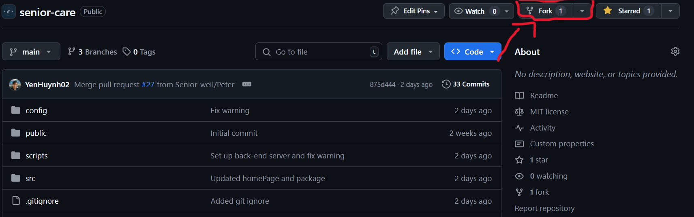
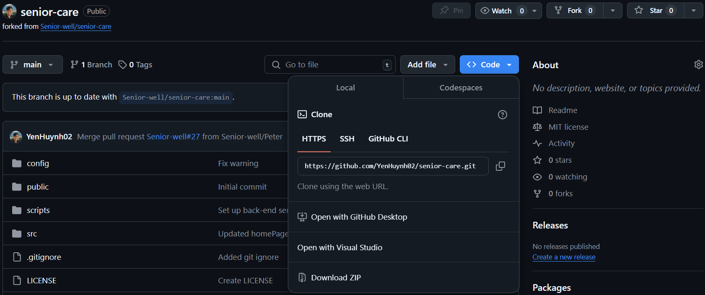
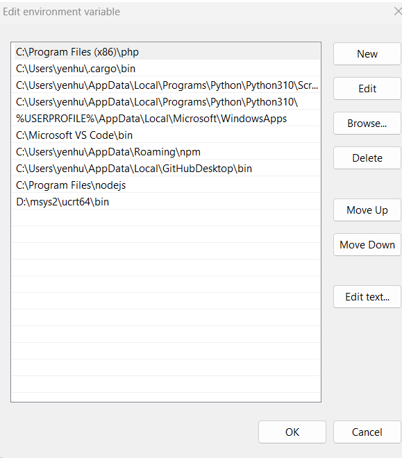

<h1 align="center"> What is a Senior Care app? </h1>

`An app to support elder with their blood clotting, high blood pressure`

<br>

<h1 align="center"> Required Node >= 14.0 </h1>


### Check the version on cmd or vs code terminal
```bash
node -v
```

<br>

<h1 align="center"> How to start? </h1>

```bash
git clone https://github.com/Senior-well/senior-care.git
```

<h3 align="center"> Then </h3>

```bash
cd senior-care
```

<h3 align="center"> And </h3>

```bash
npm install
```

```bash
npm run dev
```

<br>

<h1 align="center"> Want to make it into your own repository?</h1>


<h3 align="center"> Then go to your repository like the image below to copy the link </h3>


<h3 align="center"> Created a new folder and open it in VsCode then in the terminal do:</h3>

```bash
git clone https://github.com/'YourGithubName'/senior-care.git
```
```bash
cd senior-care
```
```bash
npm install
```

<h3 align="center"> How to connect to the remote origin branch in Senior Care?</h3>

```bash
git remote add upstream https://github.com/Senior-well/senior-care.git 
```

### Retrieve all the branches from the Senior Care

```bash
git fetch upstream
```
```bash
git checkout remotes/origin/'branchname'
```
```bash
npm run dev
```

<br>

<h1 align="center">How to serve a static producution build of web application on a local or remote server?</h1>

```bash
npm run build
```
```bash   
serve -s build
```

<br>

<h1 align="center">How to run php application?</h1>

### Installation:

<a href='https://www.php.net/downloads.php'>https://www.php.net/downloads.php</a>

### Set `Path` in `Edit environment variables for your account` on computer:
<p align='center'>
    
</p>

### Open cmd or git bash and do:
```php
php -v /*For checking the version if it availables*/
```
```bash
php -S localhost:8010
```

### Require to run to application at the same time which are:

```bash
`npm run dev` and `php -S localhost:8010`
```

### to connect between front-end and back-end server

<h3 align="center"> Good luck! 😎 </h3>

# Noted:
`Remember to do Pull Request(PR) for reviewing before commit into the main branch`

<br>

<p>PR can be perform by:</p>

---
### Step 0: Make a new branch
```
git checkout -b branchName
```

### Step 1: Checking modified file
```
git status
```

### Step 2: Add modified files
```
git add filename
```

### Step 3: Commit time baby!
```
git commit -m 'commit message'
```

### Step 4: Push it up
```
git push origin -u branchName
```

Tips: 
- `Shift + Alt + F` for automatic align code.
- Some case the node_modules doesn't work out (not install all of independencies in the package.json), do:

```
npm install --savedev
```
