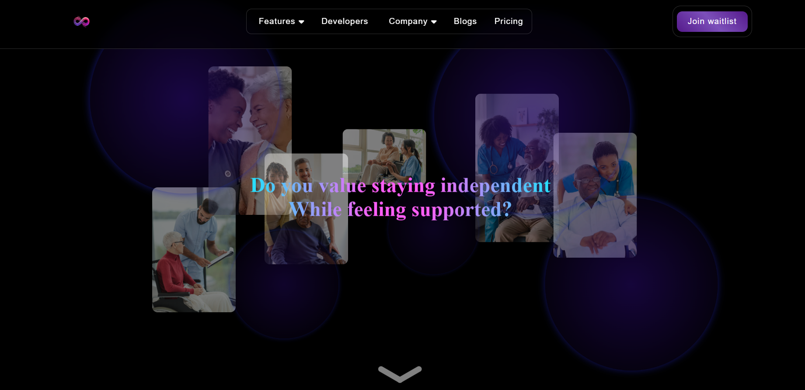

<h1>1. Welcome to Senior Well </img></h1>

</img>

 

<h1>2. What is a senior care app?</h1>
<table align='center'>
    <tr align='center'>
        <td>No.</td>
        <td>Features</td>
        <td>Purpose</td>        
    </tr>
    <tr>
        <td>1</td>
        <td>Real-Time Health Monitoring</td>
        <td>+ Tracks heart rate and blood pressure.</td>
    </tr>
    <tr>
        <td>2</td>
        <td>Instant Alerts for Emergencies</td>
        <td>
            + Detect issues and notifies instantly. 
            + Alerts nearest caregiver for quick help.
        </td>
   </tr>
    <tr>
        <td>3</td>
        <td>Caregiver or Family Coordination</td>
        <td>+ Keeps you updated about loved ones.</td>
   </tr>
    <tr>
        <td>4</td>
        <td>Smart Integration by using Smart Watches</td>
        <td>+ Syncs with wearables for seamless tracking.</td>
   </tr>
</table>

 

<h1>3. Pricing and Release date</h1>
<h3 align='center'>Upcoming</h3>

 

<h1>4. Want priority access? Become our sponsor!</h1>
<h3 align='center'>Upcoming</h3>